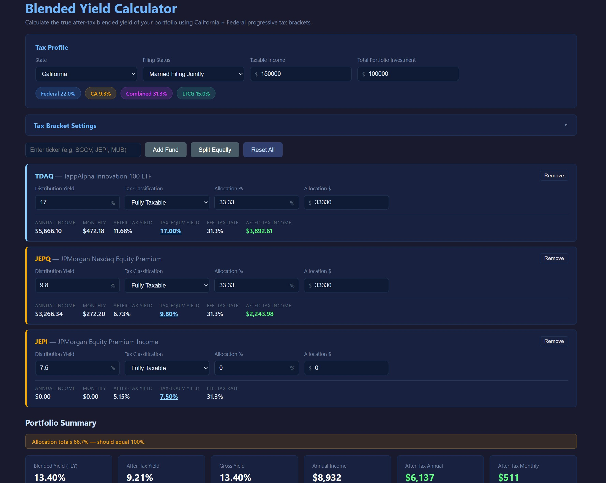
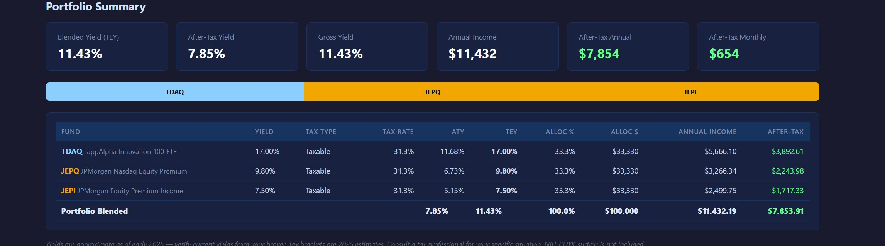
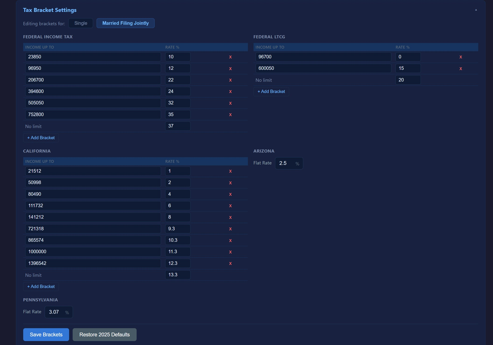

# Blended Yield Calculator

## What It Is

The Blended Yield Calculator shows the **true after-tax yield** of your investment portfolio, accounting for Federal and state progressive tax brackets. It calculates what you actually *keep* from each fund after taxes, then blends them weighted by allocation to show your portfolio's real income.

## Key Concepts

### After-Tax Yield (ATY)
The yield you actually receive after paying taxes. Calculated as:
```
ATY = yield × (1 − applicable tax rate)
```
For example, if a fund yields 10% and your tax rate is 31.3%, the ATY is 6.87%.

### Tax-Equivalent Yield (TEY)
What a fully taxable bond would need to yield to give you the same after-tax income as a tax-exempt fund. Used to compare apples-to-apples:
```
TEY = ATY / (1 − full tax rate)
```
For example, a muni fund yielding 3% at 31.3% tax rates equals a fully taxable yield of 4.37%.

### Blended Yield
The portfolio's weighted-average tax-equivalent yield across all holdings. This is the single best metric to compare different portfolio allocations.

### Six Tax Classifications
- **Fully Taxable** — Corporate bonds, BDCs, REITs, covered-call ETFs (JEPI, XYLD)
- **Treasury (State Exempt)** — T-bills, Treasury ETFs (SGOV, TLT) — Federal tax only
- **Fed Exempt (Muni)** — National municipal bonds — State tax only
- **Fed+State Exempt** — State-specific municipal bonds — No federal or state tax
- **Return of Capital (ROC)** — CEFs, MLPs, single-stock option funds (YieldMax) — Taxed at LTCG rates
- **Qualified / LTCG** — Qualified dividends, growth ETFs (SPY, QQQ) — Long-term capital gains rates

## How to Use

### Step 1: Set Your Tax Profile

1. Select your **State** (California, Arizona, or Pennsylvania)
2. Choose **Filing Status** (Single or Married Filing Jointly)
3. Enter your **Taxable Income** (used to determine marginal tax brackets)
4. Enter your **Total Portfolio Investment** amount

The calculator displays your current Federal, State, Combined, and LTCG marginal tax rates at the top.

**Screenshot 1:** Portfolio Setup


### Step 2: Add Funds

1. Enter a ticker symbol (e.g., `SGOV`, `JEPI`, `MUB`, `TDAQ`)
2. Click **Add Fund** — the calculator looks up the fund in its database
3. If found, the name, yield, and tax type fill automatically
4. If not found, you'll be prompted to enter the yield manually (saves to localStorage for future sessions)

### Step 3: Configure Each Fund

For each added fund card:
1. **Distribution Yield %** — Annual yield (verify current yield from your broker)
2. **Tax Classification** — Select the appropriate tax type for this fund
3. **Allocation %** or **Allocation $** — Enter one, the other calculates automatically

The card displays results in real-time:
- **Annual Income** and **Monthly Income**
- **After-Tax Yield (ATY)** — What you actually keep
- **Tax-Equiv Yield (TEY)** — Used in blended calculation (shown **bold** and underlined when active)
- **Eff. Tax Rate** — The tax impact on this fund

### Step 4: Review Portfolio Summary

The **Portfolio Summary** at the bottom shows:
- **Blended Yield (TEY)** — Your portfolio's composite after-tax yield
- **After-Tax Yield** — Portfolio average ATY
- **Gross Yield** — Unweighted average of all funds
- **Annual Income** — Total dollar income (gross)
- **After-Tax Annual** — Total income you keep (green)
- **After-Tax Monthly** — Monthly spendable income (green)

A color-coded allocation bar shows the weight of each fund. A breakdown table lists every fund with yields, tax rates, allocations, and income.

**Screenshot 2:** Portfolio Summary Results


## Customizing Tax Brackets

### Editing Brackets

The **Tax Bracket Settings** panel lets you customize Federal, State, and LTCG brackets if rates change:

1. Click **Tax Bracket Settings** to expand
2. Toggle between **Single** and **Married Filing Jointly** filing statuses
3. Edit bracket thresholds and rates for:
   - Federal Income Tax (progressive, 7 brackets)
   - Federal LTCG (3 brackets)
   - California (10 brackets, includes Mental Health Surcharge)
   - Arizona (flat 2.5%)
   - Pennsylvania (flat 3.07%)

4. **+ Add Bracket** — Insert a new bracket row
5. **x Remove** — Delete a bracket row
6. Click **Save Brackets** — Persists to browser localStorage
7. Click **Restore 2025 Defaults** — Resets to 2025 tax rates

A "**Custom**" badge appears when custom brackets are saved. An "**Unsaved**" badge appears when you've made changes but haven't saved yet.

**Screenshot 3:** Tax Bracket Editor


## Built-in Fund Database

The calculator includes 100+ common income funds:

**Covered-Call ETFs:** JEPI, JEPQ, XYLD, QYLD, RYLD, SPYI, QQQI, SVOL, QDVO

**YieldMax (Single-Stock Options):** TSLY, NVDY, MSFO, AMZY, CONY, PLTY, AIXY, and 10+ more

**TappAlpha:** TDAQ, TSPY

**Global X:** PFFD, MLPX, MLPA, EFAS, SDIV, ALTY, HYKE, LQDW

**REX Shares:** FEPI, AIPI, CEPI

**Amplify:** DIVO, YYY, QDVO, BLOK

**Kurv:** KSPY, KQQQ, KNVD, KTSL, KAPL, KMET, KAMZ

**SABA:** CEFS

**CEFs:** PDI, PDO, PTY, GOF, TRIN, ARCC, MAIN, OBDC, HTGC

**BDCs:** ARCC, MAIN, OBDC, HTGC, GBDC, TRIN

**Municipals:** MUB, VTEB, HYD, CMF, NAD, NEA, NKX, VCV

**Treasuries:** SGOV, BIL, TLT, IEF, USFR, VGIT, VGLT

**REITs:** O, STAG, AGNC, NLY, RITM

**Growth:** SPY, VOO, QQQ, VTI, SCHD, GLD, IBIT

## Important Notes

### Yields Are Approximate
The built-in database has approximate yields as of early 2025. **Always verify current yields from your broker or fund provider** before relying on calculations. Update any yield manually in the card — it saves to localStorage.

### State-Specific Muni Funds
California-specific muni funds (CMF, NKX, VCV) automatically reclassify when you switch states:
- In CA: Taxed as Fed+State Exempt (no tax)
- In AZ or PA: Taxed as Fed Exempt (federal tax applies)

### Pennsylvania Special Rule
Pennsylvania exempts *all* municipal bond interest from state tax, even national muni funds. So MUNI_NAT funds show 0% state tax in PA.

### Not Financial Advice
This is a calculator only. Tax situations vary widely by individual. **Consult a tax professional** for your specific situation.

## Tips & Tricks

**Compare Allocations Easily:** Adjust allocation % or $ in any card; the blended yield updates in real-time. Test different mixes (60% bonds, 40% covered calls vs. 50/50) to find the best after-tax income for your situation.

**Verify Tax Classifications:** Wrong tax type = wrong after-tax yield. Double-check:
- Corporate bonds and most CEFs are Fully Taxable
- Treasuries are State Exempt
- National munis are Fed Exempt
- State-specific munis are Fed+State Exempt (in their home state)
- Most option-income funds (YieldMax, single-stock strategies) are ROC

**Save Custom Brackets Once:** If your state raises rates or you expect rate changes, edit and save custom brackets once. They persist in your browser until you click **Restore 2025 Defaults**.

**Manual Fund Lookup:** If a ticker doesn't auto-populate:
1. Search your broker or Morningstar for the current yield
2. Enter it manually (a 1.5s timeout gives search time)
3. The fund saves to localStorage with a blue ★ badge for next time

**Allocation Constraints:** Allocations must sum to 100% for meaningful blended yield. The calculator warns if they don't, but still computes based on proportional weights.
